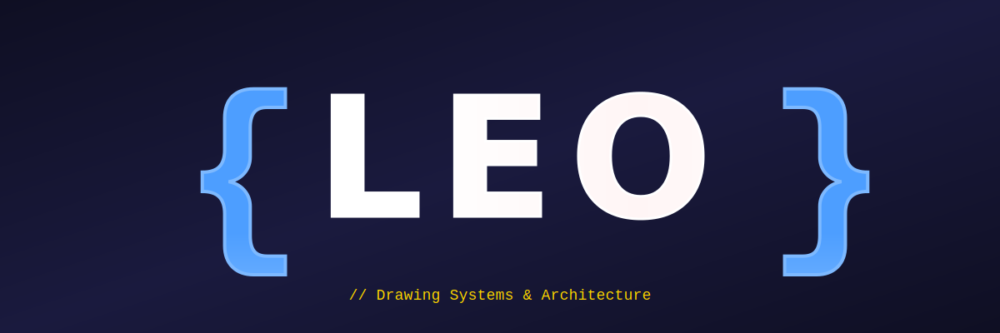

<div align="center">
  
  <!-- 코딩 심볼 LED 네온 배너 -->
  
  
  <br/><br/>
  
  <!-- 흔들리는 키워드 SVG들 -->
  
  
  
  
  <br/><br/>
  
  <!-- 타이핑 애니메이션 -->
  
  
</div>

<br/>

---

<br/>

## 👨‍💻 const LEO = { ... }

```javascript
const express = require('express');
const LEO = express();

// Core Identity
LEO.set('role', 'Tech Lead & System Architect');
LEO.set('company', 'DDukDDak');
LEO.set('mission', [
  'WebRTC-based Real-time 3D Streaming Infrastructure',
  'Backend Platform Architecture Design', 
  'Automation & Operations at Scale'
]);

// Technical Expertise
LEO.use('/specialization', {
  streaming: {
    technology: 'WebRTC-based Real-time 3D Rendering',
    engine: 'Unreal Engine 5.5',
    use_cases: ['Interior Design Visualization', 'Upcoming Steam Game Development']
  },
  backend: {
    stack: 'Node.js/Express + Prisma ORM',
    architecture: 'Modular Monolithic with Future MSA Readiness',
    database: 'MySQL + Redis for Distributed Sessions'
  },
  infrastructure: {
    cloud: 'Kakao Cloud with Dynamic VM Provisioning',
    orchestration: 'Docker + Portainer + GitHub Actions',
    monitoring: 'Grafana + Prometheus + Loki'
  }
});

// Philosophy - Inspired by Elbert Hubbard
LEO.use('/philosophy', (req, res, next) => {
  const wisdom = {
    quote: '"Do not take life too seriously. You will never get out of it alive."',
    author: '— Elbert Hubbard',
    interpretation: [
      'Build systems that survive, not systems that are perfect',
      'Long-term maintainability over short-term perfection',
      'Pragmatic architecture that scales with reality',
      'Operational stability beats theoretical elegance'
    ]
  };
  
  res.json({
    principle: 'Sustainable Architecture Philosophy',
    motto: 'Production-Stable Systems > Perfect Code',
    approach: wisdom
  });
  
  next();
});

// Current Mission
LEO.get('/now', (req, res) => {
  res.status(200).json({
    project: 'DDukDDak - AI Interior Design Platform',
    stack: 'WebRTC 3D Streaming + RAG-powered AI Consultation',
    milestone: 'February 2025 Closed Beta Launch',
    tasks: [
      '⚡ Kakao Cloud OpenAPI integration for auto-scaling',
      '🎮 Multiple Cirrus server orchestration via Matchmaker',
      '🔐 Redis-based distributed session management',
      '📦 TypeScript migration with Prisma type generation',
      '🎯 Steam game development with Unreal Engine'
    ]
  });
});

// Error Handling - Learn from Production
LEO.use((err, req, res, next) => {
  console.error('💥 Error detected:', err.message);
  
  // Philosophy in action: graceful degradation
  res.status(500).json({
    error: 'System architecture evolving...',
    recovery: 'Analyze logs → Network diagnostics → Incremental fixes',
    lesson: 'Every failure teaches sustainable design'
  });
});

// System Online
const PORT = process.env.PORT || 3000;
LEO.listen(PORT, () => {
  console.log(`🚀 LEO's Architecture running on port ${PORT}`);
  console.log('🎨 Drawing systems that last, not just systems that shine');
  console.log('⚡ Building for the long run, one pragmatic decision at a time');
});

module.exports = LEO;
```

<br/>

---

<br/>

## 🛠️ Tech Stack

<div align="center">

<table>
<tr>
<td width="500" valign="top">


<table>
<tr><td colspan="2"></td></tr>
<tr><th width="100" align="left">Layer</th><th align="left">Stack</th></tr>
<tr><td width="100"><b>Cloud</b></td><td>
<br/>


</td></tr>
<tr><td width="100"><b>Infra</b></td><td>

<br/>


</td></tr>
<tr><td width="100"><b>CI/CD</b></td><td>
<br/>

</td></tr>
<tr><td width="100"><b>Monitor</b></td><td>

<br/>

</td></tr>
<tr><td width="100"><b>DevOps</b></td><td>


</td></tr>
<tr><td width="100"><b>Database</b></td><td>

<br/>

</td></tr>
<tr><td width="100"><b>IDE</b></td><td>


</td></tr>
</table>

---


<table>
<tr><td colspan="2"></td></tr>
<tr><th width="100" align="left">Layer</th><th align="left">Stack</th></tr>
<tr><td width="100"><b>Language</b></td><td>

<br/>

</td></tr>
<tr><td width="100"><b>Framework</b></td><td>

<br/>

<br/>

</td></tr>
</table>

---


<table>
<tr><td colspan="2"></td></tr>
<tr><th width="100" align="left">Layer</th><th align="left">Stack</th></tr>
<tr><td width="100"><b>Framework</b></td><td>


</td></tr>
<tr><td width="100"><b>Styling</b></td><td>

</td></tr>
</table>

</td>
<td width="50"></td>
<td width="500" valign="top">


<table>
<tr><td colspan="2"></td></tr>
<tr><th width="100" align="left">Type</th><th align="left">Stack</th></tr>
<tr><td width="100"><b>Engine</b></td><td>

</td></tr>
<tr><td width="100"><b>Streaming</b></td><td>

</td></tr>
</table>

---


<table>
<tr><td colspan="2"></td></tr>
<tr><th width="100" align="left">Purpose</th><th align="left">Stack</th></tr>
<tr><td width="100"><b>LLM</b></td><td>


</td></tr>
<tr><td width="100"><b>ML/CV</b></td><td>

<br/>

</td></tr>
<tr><td width="100"><b>Vector</b></td><td>


</td></tr>
<tr><td width="100"><b>Notebook</b></td><td>


</td></tr>
</table>

</td>
</tr>
</table>

</div>

<br/>

---

<br/>

## 🏗️ Architecture Philosophy

```javascript
/**
 * LEO's Sustainable Architecture Manifesto
 * 
 * "Do not take life too seriously. You will never get out of it alive."
 * — Elbert Hubbard
 * 
 * In code: Build systems that SURVIVE, not systems that are PERFECT.
 */

const philosophy = {
  
  // Core Belief: Longevity over Perfection
  sustainability: {
    principle: 'Long-term maintainability beats short-term brilliance',
    why: 'Perfect systems fail under real-world pressure',
    how: [
      'Modular boundaries for future evolution',
      'Operational stability as first-class concern',
      'Documentation that survives team changes',
      'Error handling that teaches, not just catches'
    ]
  },
  
  // Architecture Pattern
  structure: {
    pattern: 'Modular Monolithic Architecture',
    tradeoff: 'Solo/small team efficiency + Future MSA readiness',
    decision: 'Start simple, split when pain exceeds cost',
    modules: 'Feature-based > Layer-based (for AI context & maintainability)'
  },
  
  // Code Standards
  pragmaticCode: {
    naming: '*.routes.js → *.controller.js → *.service.js → *.model.js',
    errorFlow: 'Controllers: success() only | Services: throw fail/Error',
    typeSystem: 'Prisma ORM → Type-safe queries → TypeScript migration prep',
    validation: 'Joi at boundaries, Prisma types internally'
  },
  
  // Infrastructure Principles
  operations: {
    separation: 'NPM proxy | Bastion SSH | Dedicated monitoring servers',
    networking: 'Manual port forwarding > UPnP (learned the hard way)',
    deployment: 'Docker + GitHub Actions (hybrid runners for security)',
    scaling: 'Vertical first, horizontal when metrics prove necessity'
  },
  
  // Performance Wisdom (Battle-Tested)
  optimization: {
    streaming: {
      lesson: 't.MaxFPS 30 prevents GPU bottleneck (unlimited FPS = death)',
      gpu: 'DLSS optimization: 29% utilization with quality maintained',
      tsrConflict: 'TSR + DLSS = choose one, mixing kills performance'
    },
    sessions: 'Redis for distributed state (MySQL for durability)',
    caching: 'Cache what scales poorly, not what changes frequently'
  },
  
  // The Hubbard Principle in Action
  realityCheck: {
    perfectionist: 'Rewrites code 10 times, launches never',
    pragmatist: 'Ships v1, learns from users, iterates to v10',
    winner: 'Pragmatist - because systems that don\'t ship don\'t survive',
    reminder: 'Production failures teach more than pristine local tests'
  }
  
};

// Final Wisdom
console.log('🎨 Drawing architecture for the long haul...');
console.log('⚡ Building systems that survive reality, not just impress peers');
console.log('🚀 Remember: Working software > Perfect software');

export default philosophy;
```

<br/>

---

<br/>

## 📊 GitHub Activity

<div align="center">
  
  
  
  

</div>

<br/>

<div align="center">
  
  [](https://git.io/streak-stats)

</div>

<br/>

---

<br/>

## 💼 Current Mission: DDukDDak

```mermaid
graph TB
    subgraph "Client Layer"
        A[User Browser/App]
    end
    
    subgraph "WebRTC Streaming Infrastructure"
        B[Matchmaker Service]
        C[Cirrus Server 1]
        D[Cirrus Server 2]
        E[Cirrus Server N...]
    end
    
    subgraph "Compute Layer - Kakao Cloud"
        F[UE5.5 Instance 1<br/>DLSS Optimized]
        G[UE5.5 Instance 2<br/>Dynamic Provisioning]
        H[UE5.5 Instance N<br/>Auto-scaling]
    end
    
    subgraph "Backend Services"
        I[Express Backend API]
        J[MySQL + Prisma ORM]
        K[Redis Session Store]
    end
    
    subgraph "AI Services"
        L[RAG Consultation System]
        M[Pinecone Vector DB]
        N[OpenAI GPT-4]
    end
    
    A -->|WebRTC Request| B
    B -->|Load Balance| C
    B -->|Route| D
    B -->|Distribute| E
    
    C <-->|WebSocket| F
    D <-->|WebSocket| G
    E <-->|WebSocket| H
    
    A -->|REST API| I
    I -->|Query| J
    I -->|Session| K
    I -->|AI Request| L
    
    L -->|Semantic Search| M
    L -->|LLM Response| N
    
    style A fill:#61DAFB,stroke:#333,stroke-width:2px
    style B fill:#FF6B6B,stroke:#333,stroke-width:2px
    style C fill:#FFD93D,stroke:#333,stroke-width:2px
    style D fill:#FFD93D,stroke:#333,stroke-width:2px
    style E fill:#FFD93D,stroke:#333,stroke-width:2px
    style F fill:#764BA2,stroke:#333,stroke-width:2px
    style G fill:#764BA2,stroke:#333,stroke-width:2px
    style H fill:#764BA2,stroke:#333,stroke-width:2px
    style I fill:#339933,stroke:#333,stroke-width:2px
    style J fill:#4479A1,stroke:#333,stroke-width:2px
    style K fill:#DC382D,stroke:#333,stroke-width:2px
    style L fill:#412991,stroke:#333,stroke-width:2px
    style M fill:#000000,stroke:#FFD700,stroke-width:2px
    style N fill:#412991,stroke:#333,stroke-width:2px
```

<div align="center">



### 🎯 **DDukDDak** - AI-Powered Interior Design Platform

**Tech Stack:**
- **Streaming**: WebRTC-based 3D Visualization with Unreal Engine 5.5
- **Backend**: Node.js/Express + Prisma ORM + MySQL/Redis
- **AI**: RAG System (Pinecone + OpenAI) for Design Consultation
- **Infrastructure**: Kakao Cloud + Docker + Dynamic VM Provisioning

**Target**: February 2025 Closed Beta Launch

**What's Next**: Steam game development leveraging the same UE5.5 infrastructure

</div>

<br/>

---

<br/>

## 🎮 Beyond Enterprise: Gaming Ahead

```javascript
// Upcoming: Leveraging Unreal Engine for Game Development
const futureVision = {
  platform: 'Steam',
  engine: 'Unreal Engine 5.5',
  leverage: [
    'Reuse DDukDDak streaming infrastructure knowledge',
    'Apply production-hardened architecture patterns',
    'Bridge enterprise tech with gaming creativity'
  ],
  philosophy: 'Same engine, different canvas - still drawing systems'
};

console.log('🎮 From interior design visualization to full games');
console.log('🚀 Building worlds, not just software');
```

<br/>

---

<br/>

## 📫 Let's Connect

<div align="center">

```javascript
const contact = {
  openTo: [
    'WebRTC & Real-time Streaming Architecture',
    'Unreal Engine Integration & Optimization',
    'Backend System Design & Scalability',
    'Infrastructure Automation & Operations',
    'Gaming + Enterprise Tech Crossover'
  ],
  response: 'Usually within 24 hours',
  philosophy: 'Building systems that survive > Building perfect systems'
};

// Always happy to discuss sustainable architecture
```

<br/>

[](https://hits.seeyoufarm.com)

</div>

<br/>

---

<div align="center">
  
  <br/>
  
  ### ⚡ The Hubbard Principle
  
  **"Do not take life too seriously. You will never get out of it alive."**  
  — Elbert Hubbard
  
  <br/>
  
  <sub>Building systems that survive reality 🎨 Not chasing perfection that never ships 🚀</sub>
  
  <br/><br/>
  
</div>
