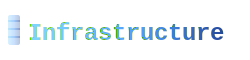
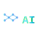
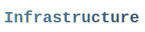
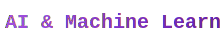

<div align="center">
  
  <!-- LED 네온 배너 -->
  
  
  <br/><br/>
  
  <!-- 키워드 SVG들 - 5개 기술 스택 -->
  
  
  
  
  
  
  <br/><br/>
  
  <!-- 타이핑 애니메이션 -->
  
  
</div>

<br/>

---

<br/>

## 👨‍💻 const LEO = { ... }

```javascript
const LEO = {
  role: 'Tech Lead & System Architect',
  
  focus: [
    'Backend Architecture & Infrastructure',
    'WebRTC Real-time 3D Streaming',
    'Unreal Engine Content Development'
  ],
  
  expertise: {
    backend: {
      stack: 'Node.js/Express + Prisma ORM',
      database: 'Schema-driven design with 17+ tables, type-safe migrations',
      architecture: 'Modular Monolithic → MSA Ready'
    },
    infrastructure: {
      orchestration: 'Docker + Portainer + GitHub Actions CI/CD',
      networking: 'Nginx Proxy Manager + Cloudflare integration',
      collaboration: 'Team-wide NAS infrastructure, version control, deployment standards',
      monitoring: 'Grafana + Prometheus + Loki for production observability'
    },
    streaming: {
      'Unreal Engine': 'Metaverse production experience, interactive content development',
      'WebRTC': '3D streaming infrastructure with Unreal Engine integration'
    },
    ai: {
      rag: 'Pinecone vector DB + OpenAI embeddings for intelligent recommendations',
      ml: 'Custom ML models with OpenCV, Pandas, NumPy for data-driven insights'
    }
  },
  
  principles: 'Building systems designed to evolve, not just to launch'
};
```

<details>
<summary><b>🇰🇷 한국어 버전</b></summary>

<br/>

```javascript
const LEO = {
  역할: '기술 리드 & 시스템 아키텍트',
  
  집중분야: [
    '백엔드 아키텍처 및 인프라',
    'WebRTC 실시간 3D 스트리밍',
    '언리얼 엔진 콘텐츠 개발'
  ],
  
  전문기술: {
    백엔드: {
      스택: 'Node.js/Express + Prisma ORM',
      데이터베이스: '17개 이상 테이블 설계, 타입 안전 마이그레이션',
      아키텍처: '모듈러 모놀리스 → MSA 전환 준비'
    },
    인프라: {
      오케스트레이션: 'Docker + Portainer + GitHub Actions CI/CD',
      네트워킹: 'Nginx Proxy Manager + Cloudflare 통합',
      협업환경: '팀 전체 NAS 인프라, 버전 관리, 배포 표준화',
      모니터링: 'Grafana + Prometheus + Loki 운영 가시성'
    },
    스트리밍: {
      '언리얼 엔진': '메타버스 제작 경험, 인터랙티브 콘텐츠 개발',
      'WebRTC': '언리얼 엔진을 활용한 3D 스트리밍 인프라'
    },
    AI: {
      RAG: 'Pinecone 벡터 DB + OpenAI 임베딩 기반 지능형 추천',
      ML: 'OpenCV, Pandas, NumPy 기반 커스텀 ML 모델'
    }
  },
  
  원칙: '출시로 끝나지 않고, 진화하도록 설계된 시스템 구축'
};
```

</details>

<br/>

---

<br/>

## 🛠️ Tech Stack

<table width="100%">
<tr>
<td width="49%" valign="top">



<table width="100%">
<tr><th width="25%" align="left">Layer</th><th width="75%" align="left">Stack</th></tr>
<tr><td><b>Cloud</b></td><td>
<br/>


</td></tr>
<tr><td><b>Infra</b></td><td>

<br/>


</td></tr>
<tr><td><b>Network</b></td><td>


</td></tr>
<tr><td><b>CI/CD</b></td><td>
<br/>

</td></tr>
<tr><td><b>Monitor</b></td><td>

<br/>

</td></tr>
<tr><td><b>DevOps</b></td><td>


</td></tr>
<tr><td><b>Database</b></td><td>

<br/>

</td></tr>
<tr><td><b>IDE</b></td><td>


</td></tr>
</table>

---


<table width="100%">
<tr><th width="25%" align="left">Layer</th><th width="75%" align="left">Stack</th></tr>
<tr><td><b>Language</b></td><td>

<br/>

</td></tr>
<tr><td><b>Framework</b></td><td>

<br/>

<br/>

</td></tr>
</table>

---


<table width="100%">
<tr><th width="25%" align="left">Layer</th><th width="75%" align="left">Stack</th></tr>
<tr><td><b>Framework</b></td><td>


</td></tr>
<tr><td><b>Styling</b></td><td>

</td></tr>
</table>

</td>
<td width="2%"></td>
<td width="49%" valign="top">


<table width="100%">
<tr><th width="25%" align="left">Type</th><th width="75%" align="left">Stack</th></tr>
<tr><td><b>Engine</b></td><td>

</td></tr>
<tr><td><b>Streaming</b></td><td>

</td></tr>
</table>

---



<table width="100%">
<tr><th width="25%" align="left">Purpose</th><th width="75%" align="left">Stack</th></tr>
<tr><td><b>LLM</b></td><td>


</td></tr>
<tr><td><b>ML/CV</b></td><td>

<br/>

</td></tr>
<tr><td><b>Vector</b></td><td>


</td></tr>
<tr><td><b>Notebook</b></td><td>


</td></tr>
</table>

</td>
</tr>
</table>

<br/>

---

<br/>

## 📊 GitHub Stats

<div align="center">

<table>
<tr>
<td align="center" width="280">

**Most Used Languages**


</td>
<td width="40"></td>
<td align="center" width="380">

**GitHub Stats**


</td>
</tr>
</table>

</div>

<br/>

---

<br/>

## 🔗 Connect & Learn More

<div align="center">

<table>
<tr>
<td align="center" width="180">

**🌐 Portfolio (preparing)**

<a href="https://your-name.vercel.app" target="_blank">
  
</a>

<sub>Projects & Case Studies</sub>

</td>
<td width="30"></td>
<td align="center" width="180">

**📚 Tech Docs (preparing)**

<a href="https://robanian.github.io" target="_blank">
  
</a>

<sub>Architecture & Practices</sub>

</td>
<td width="30"></td>
<td align="center" width="180">

**📝 Blog (preparing)**

<a href="https://your-blog.tistory.com" target="_blank">
  
</a>

<sub>Technical Insights</sub>

</td>
</tr>
<tr><td colspan="5" height="20"></td></tr>
<tr>
<td align="center" width="180">

**💼 LinkedIn (preparing)**

<a href="https://linkedin.com/in/your-profile" target="_blank">
  
</a>

<sub>Professional Network</sub>

</td>
<td width="30"></td>
<td align="center" width="180">

**📧 Email**

<a href="mailto:colorfuleffect@gmail.com">
  
</a>

<sub>Direct Contact</sub>

</td>
<td width="30"></td>
<td align="center" width="180">

**🎮 Steam (preparing)**

<a href="https://steamcommunity.com/id/your-id" target="_blank">
  
</a>

<sub>Game Development</sub>

</td>
</tr>
</table>

</div>

<br/><br/>
