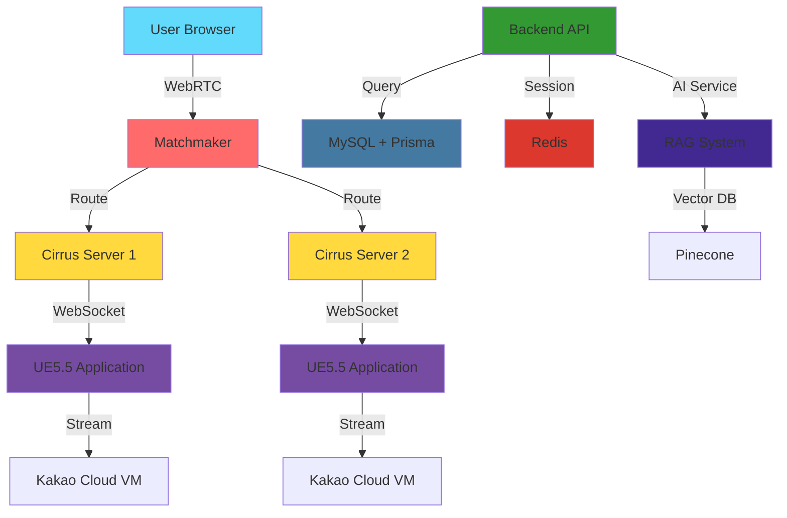

<div align="center">
  
  <!-- LED 네온 배너 -->
  
  
  <br/>
  
  <!-- 흔들리는 키워드 SVG들 -->
  
  
  
  
  <br/><br/>
  
  <!-- 타이핑 애니메이션 -->
  
  
</div>

<br/>

---

<br/>

## 👨‍💻 const LEO = { ... }

```javascript
const express = require('express');
const LEO = express();

// 기본 설정
LEO.set('role', 'Tech Lead & System Architect');
LEO.set('company', 'DDukDDak');
LEO.set('focus', [
  'WebRTC-based Real-time 3D Streaming',
  'Backend Platform Architecture', 
  'Infrastructure Automation'
]);

// 핵심 미들웨어
LEO.use('/skills', {
  streaming: 'Pixel Streaming with Unreal Engine 5.5',
  backend: 'Node.js/Express + Prisma ORM',
  infrastructure: 'Docker + Kakao Cloud + GitHub Actions',
  database: 'MySQL + Redis Session Management'
});

// 아키텍처 철학
LEO.use('/philosophy', (req, res, next) => {
  res.json({
    principle: 'Modular Monolithic over Microservices',
    reason: 'Solo/small team efficiency + Future MSA readiness',
    priority: 'Production-stable structure > Perfect architecture'
  });
  next();
});

// 현재 작업
LEO.get('/current-work', (req, res) => {
  res.status(200).json({
    project: 'AI Interior Design Platform with Pixel Streaming',
    tasks: [
      'Kakao Cloud OpenAPI integration for dynamic VM provisioning',
      'Multiple Cirrus server management via Matchmaker',
      'Redis session management implementation',
      'TypeScript migration preparation through Prisma adoption'
    ],
    target: 'February 2025 Closed Beta Launch'
  });
});

// 에러 처리
LEO.use((err, req, res, next) => {
  console.error('❌ Error:', err.message);
  res.status(500).json({
    error: 'System architecture in progress...',
    solution: 'Analyze logs → Network diagnostics → Incremental testing'
  });
});

// 서버 실행
const PORT = process.env.PORT || 3000;
LEO.listen(PORT, () => {
  console.log(`🚀 LEO's System running on port ${PORT}`);
  console.log('📐 Drawing architecture like an artist...');
});

module.exports = LEO;
```

<br/>

---

<br/>

## 🛠️ Tech Stacks

<div align="center">

### 🎨 Canvas & Brushes

| Category | Technologies |
|:--------:|:------------|
| **☁️ Cloud & Infrastructure** |     |
| **🗄️ Database & Cache** |    |
| **🔧 Backend Framework** |      |
| **🎮 Real-time Streaming** |    |
| **🎨 Frontend** |    |
| **📊 Monitoring & CI/CD** |    |
| **🤖 AI & ML** |    |

</div>

<br/>

---

<br/>

## 🎯 Architecture Philosophy

```javascript
// 시스템을 그림 그리듯 설계합니다

const philosophy = {
  structure: {
    pattern: 'Modular Monolithic Architecture',
    reason: 'Clear boundaries for future MSA readiness',
    priority: 'Solo/small team development efficiency'
  },
  
  codeStyle: {
    naming: '*.routes.js → *.controller.js → *.service.js → *.model.js',
    errorHandling: 'Controller: success() only | Service: throw fail/Error',
    typeSystem: 'Prisma ORM for type-safe queries + TypeScript migration prep'
  },
  
  infrastructure: {
    separation: 'NPM for proxy | Bastion for SSH | Dedicated monitoring',
    networking: 'Manual port forwarding > UPnP (stability)',
    deployment: 'Docker + GitHub Actions (hybrid runners)'
  },
  
  optimization: {
    streaming: 't.MaxFPS 30 to prevent GPU bottleneck',
    dlss: 'TSR conflict management for performance',
    session: 'Redis for distributed session management'
  }
};

// "완벽한 코드보다 운영 가능한 구조"
console.log('🎨 Drawing production-ready systems...');
```

<br/>

---

<br/>

## 📊 GitHub Stats

<div align="center">
  
  
  
  

</div>

<br/>

<div align="center">
  
  [](https://git.io/streak-stats)

</div>

<br/>

---

<br/>

## 💼 Current Project

<div align="center">



**DDukDDak** - AI Interior Design Platform with Real-time 3D Visualization  
🎯 Target: February 2025 Closed Beta Launch

</div>

<br/>

---

<br/>

## 📫 Let's Connect

<div align="center">

```javascript
const contact = {
  role: 'Always open to discussing system architecture & real-time streaming',
  response_time: 'Usually within 24 hours',
  topics: ['WebRTC', 'Pixel Streaming', 'Backend Architecture', 'Infrastructure']
};

// Feel free to reach out!
```

<br/>

[](https://hits.seeyoufarm.com)

</div>

<br/>

---

<div align="center">
  
  
  
  <br/>
  
  **"Do not take life too seriously. You will never get out of it alive."** — Elbert Hubbard  
  <sub>Focusing on production-stable structures over perfect architecture</sub>
  
</div>
